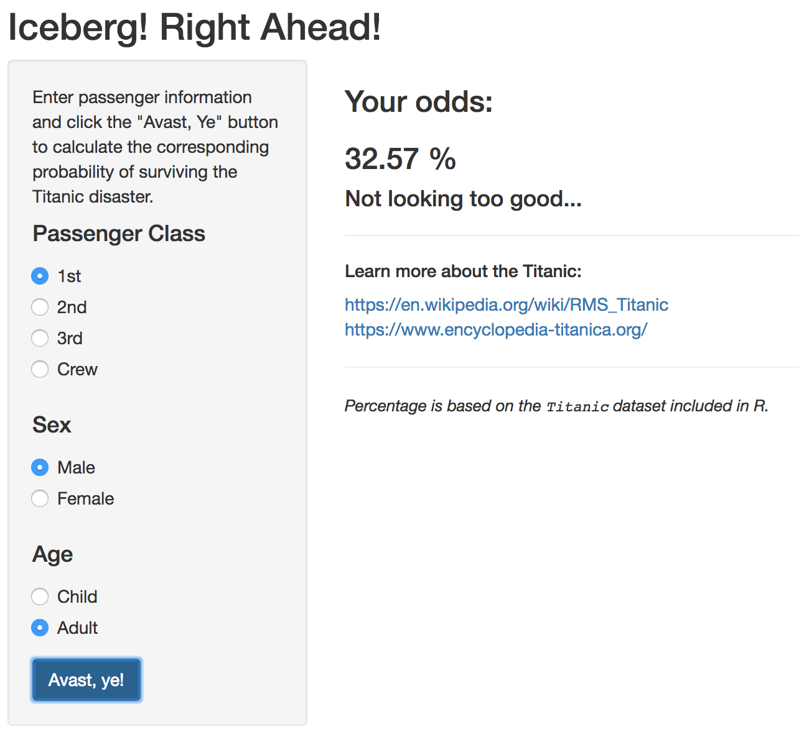

```{r setup, include=FALSE}
knitr::opts_chunk$set(echo = FALSE)
library(ggplot2)
```

<style>
.twocol {
  columns: 2 400px;
  -webkit-columns: 2 400px;
  -moz-columns: 2 400px;
}
pre {
  font-size: 14px;
}
</style>

## The Titanic

On April 15, 1912, disaster struck when the RMS Titanic collided with an iceberg in the
North Atlantic, and over 1500 of her 2200 pasesengers perished.

```{r, out.width = "400px"}
knitr::include_graphics("titanic.jpg")
```
<br/><font size="5px">*Willy Stöwer, 1931 (Public Domain)*</font>

## The Titanic

The incredible story of this "unsinkable" ship's fate has captured the
world's imagination ever since.

In 1997, the popular movie *Titanic* ignited a renewed interest among
teenagers, enraptured with the ill-fated love story of first-class
socialite Rose DeWitt Bukater (Kate Winslet) and
rough-and-tumble-but-heart-of-gold  third-class guy Jack Dawson
(Leonardo di Caprio).

*With the **Titanicly** app, users feel like they are part of that fateful evening...*

## Marketing

Following a detailed longitudinal, latitudinal, and representative study of market preferences,
we have identified a strong market for **Titanicly** among those moviegoing teenagers, now
aging millenials who grow misty-eyed and open their wallets the moment at the first sign
of nostalgia.

```{r, echo=F, fig.height=2.5}
dl <- factor(c('Yes', 'Yes'), c('Yes', 'No'))
survey <- data.frame(
  age=c(31, 32),
  sex=as.factor(c('M', 'F')),
  downloaded=dl
)

ggplot(survey, aes(downloaded)) +
  geom_bar(aes(fill=sex)) +
  scale_x_discrete(drop=FALSE) +
  labs(x='Downloaded the App?', y='Number of Users')
```

*100% of people who were preteens in 1997 will love this app*

## Introducing: The Titanicly App

**Choose a passenger type! Learn your fate (statistically speaking)!
Experience the Titanic with incredible realism!**

<div class="twocol">
```{r, out.width = "350px"}

```
<div style="width: 350px; float: right">
Leverages the incredible <tt>Titanic</tt> dataset built into R:
```{r, echo=T}
summary(Titanic)
```
</div>
</div>
